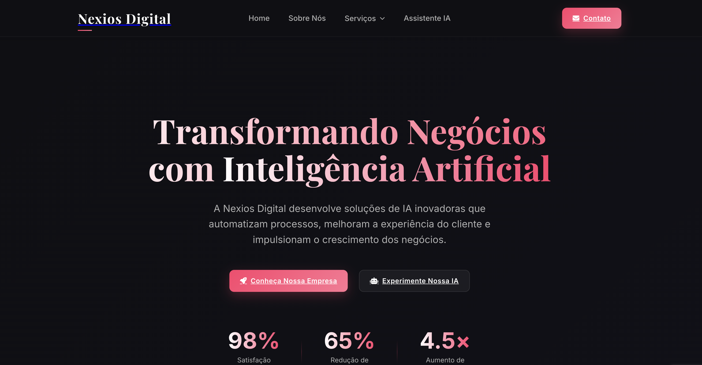

# Nexios Digital



## Sobre o Projeto

Nexios Digital é uma plataforma web moderna para uma empresa especializada em soluções de inteligência artificial que transformam processos de negócios. O site apresenta os serviços oferecidos, incluindo agentes de IA para atendimento ao cliente, automação de vendas, automação de processos e integração com ClickUp, além de um assistente virtual de IA demonstrativo .

## Tecnologias Utilizadas

### Frontend
- **React**: Biblioteca JavaScript para construção de interfaces
- **React Router**: Navegação entre páginas
- **CSS Moderno**: Design responsivo com variáveis CSS e flexbox/grid
- **EmailJS**: Serviço para envio de emails do formulário de contato
- **React Google reCAPTCHA v3**: Proteção contra spam
- **React Hook Form + Yup**: Validação de formulários

### Backend
- **FastAPI**: Framework Python para APIs de alta performance
- **OpenAI API**: Integração para funcionalidades de IA
- **MongoDB**: Banco de dados NoSQL
- **Uvicorn**: Servidor ASGI para Python

### Infraestrutura
- **Docker**: Containerização da aplicação
- **Docker Compose**: Orquestração de múltiplos containers
- **Nginx**: Servidor web e proxy reverso
- **Traefik**: Gerenciamento de rotas e SSL para produção

## Estrutura do Projeto

```
nexiosdigital-page/
├── .env                      # Variáveis de ambiente (não incluir em repositórios públicos)
├── docker-compose.yml        # Configuração Docker para desenvolvimento
├── docker-compose.prod.yml   # Configuração Docker para produção
├── docker-stack.yml          # Configuração para Docker Swarm
├── backend/
│   ├── app/                  # Código da aplicação FastAPI
│   ├── Dockerfile            # Build do container de desenvolvimento
│   ├── Dockerfile.prod       # Build do container de produção
│   ├── main.py               # Ponto de entrada da API
│   └── requirements.txt      # Dependências Python
├── frontend/
│   ├── public/               # Arquivos públicos
│   ├── src/
│   │   ├── assets/           # Imagens e outros recursos
│   │   ├── components/       # Componentes React reutilizáveis
│   │   ├── pages/            # Páginas da aplicação
│   │   ├── services/         # Serviços e integrações
│   │   ├── styles/           # Arquivos CSS
│   │   ├── utils/            # Utilitários e helpers
│   │   ├── App.jsx           # Componente principal
│   │   └── index.js          # Ponto de entrada da aplicação React
│   ├── Dockerfile            # Build do container de desenvolvimento
│   ├── Dockerfile.prod       # Build do container de produção
│   └── package.json          # Dependências e scripts NPM
└── nginx/                    # Configuração do Nginx
```

## Configuração e Instalação

### Pré-requisitos
- Docker e Docker Compose
- Node.js 18+ (para desenvolvimento local)
- Python 3.11+ (para desenvolvimento local)

### Configuração de Ambiente
1. Clone o repositório:
```bash
git clone https://github.com/yourusername/nexiosdigital-page.git
cd nexiosdigital-page
```

2. Configure as variáveis de ambiente (copie o exemplo e ajuste conforme necessário):
```bash
cp .env.example .env
```

3. Variáveis de ambiente importantes:
```
# Nome do projeto
COMPOSE_PROJECT_NAME=nexios-digital

# Domínio
DOMAIN_NAME=nexiosdigital.com

# MongoDB
MONGO_USER=seu_usuario_mongo
MONGO_PASSWORD=sua_senha_segura

# Backend
SECRET_KEY=sua_chave_secreta_gerada
OPENAI_API_KEY=sua_chave_api_openai
```

### Execução em Ambiente de Desenvolvimento

```bash
docker-compose up
```

Isso iniciará:
- Frontend React em http://localhost:3000
- API FastAPI em http://localhost:8000
- MongoDB em localhost:27017

### Execução para Produção

```bash
docker-compose -f docker-compose.prod.yml up -d
```

## Desenvolvimento

### Frontend

Para trabalhar apenas no frontend durante o desenvolvimento:

```bash
cd frontend
npm install
npm start
```

Principais diretórios e arquivos:
- `src/components/`: Componentes React reutilizáveis
- `src/pages/`: Páginas da aplicação
- `src/App.css`: Estilos globais com variáveis CSS
- `src/styles/`: Estilos específicos para componentes e páginas

### Backend

Para trabalhar apenas no backend durante o desenvolvimento:

```bash
cd backend
pip install -r requirements.txt
uvicorn main:app --reload
```

Principais recursos:
- API REST em FastAPI
- Integração com OpenAI para chat inteligente
- Endpoint de status para monitoramento

## APIs e Integrações

### API Backend
- `GET /api/status`: Verificação de status do servidor e conexão com OpenAI
- `POST /api/chat`: Endpoint de chat que utiliza a API OpenAI

### Serviços Externos
- **EmailJS**: Utilizado para envio de emails do formulário de contato
- **reCAPTCHA v3**: Proteção contra spam nos formulários
- **OpenAI API**: Integração para funcionalidade de chat com IA

## Implantação

### Usando Docker Swarm
Para implantação em um cluster Docker Swarm:

```bash
docker stack deploy -c docker-stack.yml nexiosdigital
```

### Requisitos de Infraestrutura
- Servidor com Docker e Docker Swarm inicializado
- Rede `NexiosNet` configurada para Traefik
- Certificados SSL configurados para domínio

## Funcionalidades Principais

1. **Landing Page Informativa**: Apresentação da empresa e seus serviços
2. **Páginas de Serviços Detalhadas**: Informações específicas sobre cada solução
3. **Formulário de Contato**: Com validação e envio de email
4. **Assistente Virtual IA**: Demonstração de interação com IA (em fase final de implementação)
5. **Design Responsivo**: Experiência otimizada para desktop e dispositivos móveis

## Contribuição

1. Faça um fork do projeto
2. Crie uma branch para sua feature (`git checkout -b feature/nova-funcionalidade`)
3. Faça commit das suas alterações (`git commit -m 'Adiciona nova funcionalidade'`)
4. Faça push para a branch (`git push origin feature/nova-funcionalidade`)
5. Abra um Pull Request

## Licença

Este projeto está licenciado sob a [MIT License](LICENSE).